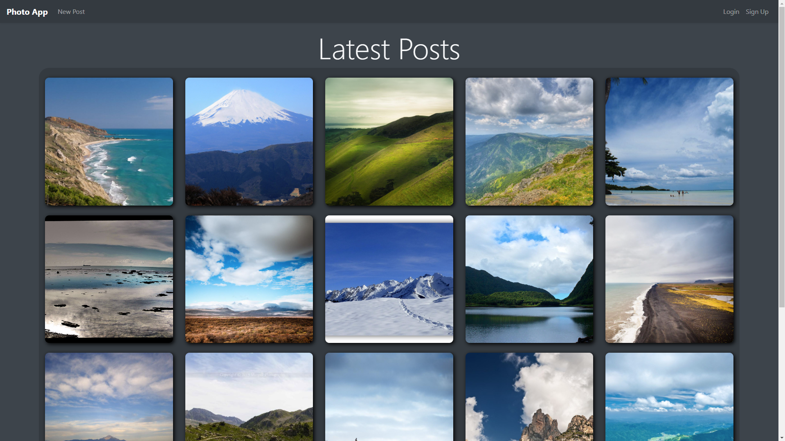

# Photo-App
A simple PHP photo sharing web app.

# Introduction
This program was created in Spring 2021 as a project for my Web Application Engineering class. This is a simple image sharing web application similar to something like Instagram. The main page of the website features an infinite scrolling page of the latest uploaded images to the site. Each image can be clicked on to view the posted image in its entirety, along with its title and other images. Users can also register, login, and upload their own posts.

# Setup
This project was created using PHP, so some kind of WAMP/MAMP will be required to run it.

Here are the required steps to get the application running.

1. Create the required database and tables. All the sql code for this can be found in the file "database.sql".

Technically, the website is fully functional at this point, but has no posts. I also included code to create some fake posts. The following steps will teach how to do that.

2. Insert all the images you would like to create posts for in the "dummy_images" folder. I have included a few, but if you want more (as in a few thousand), here is the dataset I used (too large to upload all images): https://www.kaggle.com/arnaud58/landscape-pictures

3. Create an account on the site if you have not already done so. This will be the account to use for the posts.

4. Open "fill.php" in a text editor (not the browser). Configure the 3 variables at the top of the page to your liking. 

5. Navigate to "fill.php" in the browser to run the script. It will print out once it is done.

6. Done! The website is now fully functional along with some fake posts. Navigate to "home.php" to see the home page.
